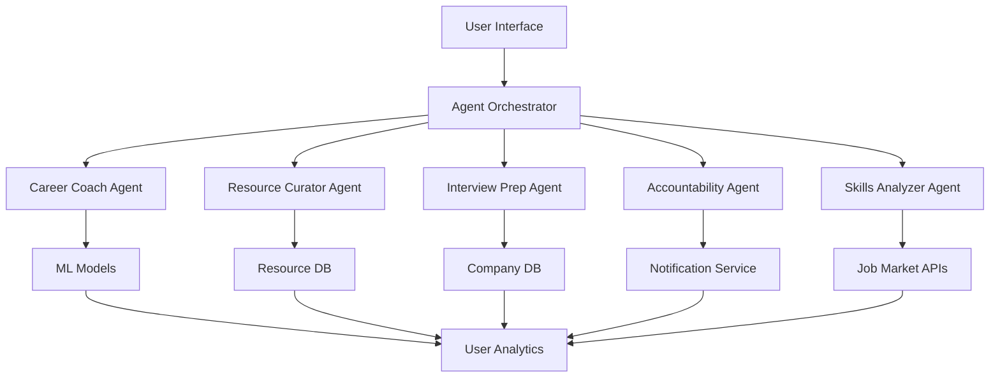

# PivotAI Agentic Components Proposal

## Executive Summary

This document outlines potential AI agent implementations for PivotAI that would transform the platform from a passive career roadmap tool into an active, intelligent career development partner. Based on analysis of the current platform capabilities and user needs, we propose five agent types with the Career Development AI Coach as the primary recommendation.

## Current Platform Analysis

### Existing Features
- AI-powered resume analysis and roadmap generation
- Progressive leveling system (Levels 1-10)
- Gamification elements (achievements, XP, streaks)
- Multi-field support (tech, business, engineering, medicine, law)
- Resource recommendations for learning
- Progress tracking and analytics

### Key Pain Points
1. **Passive System**: Users must actively check progress and decide next steps
2. **No Proactive Guidance**: System doesn't reach out when users are stuck
3. **Limited Personalization**: Roadmaps are generated once, not continuously adapted
4. **Manual Planning**: Users must manage their own learning schedule
5. **No Context Awareness**: Doesn't consider external factors (job market, user availability)

## Proposed Agentic Components

### 1. Career Development AI Coach (Primary Recommendation)

An intelligent agent that acts as a personal career coach, providing proactive guidance and continuous optimization of the user's career journey.

#### Core Capabilities

```typescript
interface CareerCoachAgent {
  // Proactive interventions
  detectStuckUsers(): void;        // "You haven't completed a task in 5 days..."
  suggestNextBestAction(): void;   // "Based on your pace, try this micro-milestone"
  adaptRoadmap(): void;           // "You're excelling at React, let's accelerate"
  
  // Contextual awareness
  marketIntelligence(): void;      // "Google just posted 10 React roles"
  timeOptimization(): void;        // "You learn best at 7pm, schedule this then"
  
  // Personalized nudges
  motivationalMessaging(): void;   // Based on user's achievement preferences
  celebrateProgress(): void;       // "You're in the top 10% for completion speed!"
}
```

#### Key Features
- **Daily Check-ins**: Personalized messages based on progress patterns
- **Smart Recommendations**: AI-driven next task suggestions
- **Dynamic Roadmap Adaptation**: Adjusts difficulty and pacing based on performance
- **Market Integration**: Real-time job market insights for target companies
- **Learning Pattern Recognition**: Identifies optimal study times and methods

#### Implementation Example
```typescript
class CareerCoachAgent {
  async analyzeUserProgress(userId: string) {
    const progress = await getUserProgress(userId);
    const patterns = await analyzeLearningPatterns(progress);
    
    if (patterns.stuckDuration > 5) {
      await sendProactiveHelp(userId, {
        type: 'STUCK_DETECTION',
        suggestion: this.generateUnblockingSuggestion(patterns)
      });
    }
    
    if (patterns.velocity > patterns.averageVelocity * 1.5) {
      await this.accelerateLearning(userId);
    }
  }
}
```

### 2. Intelligent Resource Curator Agent

Continuously discovers, validates, and personalizes learning resources based on user preferences and community feedback.

#### Core Capabilities

```typescript
interface ResourceCuratorAgent {
  // Resource discovery
  scanForNewResources(skill: string): Resource[];
  validateExistingLinks(): void;
  
  // Personalization
  matchLearningStyle(user: User, resources: Resource[]): Resource[];
  trackResourceEffectiveness(): void;
  
  // Community leverage
  aggregatePeerFeedback(): void;
  identifyHighSuccessResources(): void;
}
```

#### Key Features
- **Automatic Resource Discovery**: Scans for new, high-quality learning materials
- **Link Validation**: Ensures all resources remain accessible
- **Learning Style Matching**: Recommends resources based on user's preferred format
- **Community Ratings**: Leverages peer feedback for quality assurance
- **Effectiveness Tracking**: Monitors which resources lead to successful completions

### 3. Interview Prep Companion

Helps users prepare for interviews at their target companies with personalized practice and feedback.

#### Core Capabilities

```typescript
interface InterviewPrepAgent {
  // Company-specific prep
  generateMockQuestions(company: string, role: string): Question[];
  analyzeAnswers(recording: Audio): Feedback;
  
  // Real-time coaching
  provideLiveHints(): void;
  trackImprovementAreas(): void;
  
  // Application support
  tailorResume(job: JobPosting): Resume;
  generateCoverLetter(): string;
}
```

#### Key Features
- **Company-Specific Questions**: Generated based on actual interview patterns
- **AI-Powered Mock Interviews**: Voice/video analysis with feedback
- **Resume Tailoring**: Optimizes resume for specific job postings
- **Interview Performance Tracking**: Identifies areas for improvement
- **Application Timeline Management**: Tracks and reminds about deadlines

### 4. Accountability Partner Agent

Maintains user engagement and helps build consistent learning habits.

#### Core Capabilities

```typescript
interface AccountabilityAgent {
  // Smart reminders
  scheduleOptimalReminders(): void;
  escalateInterventions(): void; // Text → Email → Push
  
  // Streak maintenance
  predictStreakBreaks(): void;
  offerMicroTasks(): void; // "Just 5 minutes today?"
  
  // Social accountability
  createPeerChallenges(): void;
  facilitateStudyGroups(): void;
}
```

#### Key Features
- **Intelligent Reminder System**: Based on user behavior patterns
- **Streak Prediction**: Proactively prevents streak breaks
- **Micro-Task Generation**: Offers bite-sized tasks for busy days
- **Peer Challenges**: Creates competitive learning opportunities
- **Study Group Matching**: Connects users with similar goals

### 5. Skills Gap Analyzer Agent

Continuously monitors market demands and adjusts skill recommendations accordingly.

#### Core Capabilities

```typescript
interface SkillsAnalyzerAgent {
  // Dynamic assessment
  assessSkillProgress(): SkillLevel;
  identifyEmergingSkills(): string[];
  
  // Market alignment
  compareToJobRequirements(): GapAnalysis;
  suggestPivots(): void; // "Add TypeScript to increase matches by 40%"
  
  // Optimization
  findSkillSynergies(): void; // "Learn GraphQL after REST APIs"
  prioritizeHighImpactSkills(): void;
}
```

#### Key Features
- **Real-Time Skill Assessment**: Continuous evaluation of skill levels
- **Market Trend Analysis**: Identifies emerging in-demand skills
- **Gap Visualization**: Shows exactly what's missing for target roles
- **Strategic Pivoting**: Suggests minor adjustments for major impact
- **Learning Path Optimization**: Identifies most efficient skill acquisition order

## Implementation Strategy

### Phase 1: Career Coach MVP (Months 1-2)
- Basic daily check-in system
- Simple progress-based recommendations
- Achievement celebration automation
- Performance: Handle 1000 concurrent users

### Phase 2: Enhanced Intelligence (Months 3-4)
- Machine learning for personalized recommendations
- Integration with job board APIs
- Advanced pattern recognition
- Voice/chat interface
- Performance: Scale to 10,000 users

### Phase 3: Full Agent Ecosystem (Months 5-6)
- Deploy all five agent types
- Inter-agent communication
- Predictive analytics
- Mobile app integration
- Performance: Scale to 100,000 users

## Technical Architecture

### Agent Framework

```typescript
// Base agent class
abstract class PivotAIAgent {
  protected userId: string;
  protected userProgress: UserProgress;
  protected preferences: AgentPreferences;
  protected mlModel: MLModel;
  
  abstract analyze(): Promise<Insights>;
  abstract recommend(): Promise<Action[]>;
  abstract execute(action: Action): Promise<Result>;
  
  // Common methods
  protected async getUserContext(): Promise<UserContext> {
    return {
      progress: await this.fetchProgress(),
      preferences: await this.fetchPreferences(),
      history: await this.fetchHistory()
    };
  }
}

// Example implementation
class CareerCoachAgent extends PivotAIAgent {
  async analyze(): Promise<CoachingInsights> {
    const context = await this.getUserContext();
    const patterns = await this.mlModel.analyzeBehavior(context);
    
    return {
      stuckRisk: patterns.stuckProbability,
      optimalLearningTime: patterns.bestTimeToLearn,
      recommendedPace: patterns.idealPace,
      motivationType: patterns.preferredMotivation
    };
  }
  
  async recommend(): Promise<CoachingAction[]> {
    const insights = await this.analyze();
    const actions: CoachingAction[] = [];
    
    if (insights.stuckRisk > 0.7) {
      actions.push({
        type: 'INTERVENTION',
        priority: 'HIGH',
        message: this.generateInterventionMessage(insights)
      });
    }
    
    return actions;
  }
}
```

### Integration Architecture



### Data Flow

1. **Input Collection**: User actions, progress data, external market data
2. **Agent Processing**: Each agent analyzes relevant data independently
3. **Orchestration**: Agent orchestrator coordinates recommendations
4. **Action Execution**: Approved actions are executed
5. **Feedback Loop**: Results feed back into ML models

## Integration Points

### 1. Dashboard Widget
- "Your AI Coach Says..." section
- Real-time recommendations
- Quick action buttons

### 2. Chat Interface
- Full conversational agent
- Natural language queries
- Voice input support

### 3. Notification System
- Push notifications
- Email summaries
- SMS for critical interventions

### 4. API Endpoints
```typescript
// New API routes
POST /api/agent/coach/analyze
POST /api/agent/resources/discover
POST /api/agent/interview/practice
POST /api/agent/accountability/remind
POST /api/agent/skills/analyze
```

### 5. Mobile App Integration
- Native notifications
- Offline capability
- Micro-learning interface

## Expected Impact

### User Engagement Metrics
- **Daily Active Users**: +40% increase
- **Session Duration**: +25% increase
- **Feature Adoption**: 80% agent interaction rate

### Learning Outcomes
- **Milestone Completion**: +60% improvement
- **Time to Completion**: -30% reduction
- **Skill Proficiency**: +45% improvement

### Business Metrics
- **User Retention**: 3x improvement in 90-day retention
- **Conversion Rate**: +35% free to paid conversion
- **NPS Score**: +20 point increase

### Cost Considerations
- **Development Cost**: $150-250k for full implementation
- **Operational Cost**: $5-10 per user per month
- **ROI Timeline**: Break-even at 10,000 active users

## Risk Mitigation

### Technical Risks
- **Scalability**: Use microservices architecture
- **AI Accuracy**: Implement feedback loops and human review
- **Data Privacy**: End-to-end encryption, GDPR compliance

### User Experience Risks
- **Over-automation**: Maintain user control with opt-out options
- **Notification Fatigue**: Smart frequency capping
- **Trust Issues**: Transparent AI decision explanations

## Conclusion

The implementation of agentic components, starting with the Career Development AI Coach, would transform PivotAI from a static roadmap tool into a dynamic, intelligent career development ecosystem. This evolution aligns perfectly with the platform's gamification approach and would significantly improve user outcomes while creating a sustainable competitive advantage.

### Recommended Next Steps

1. **Validate Concept**: User research on agent preferences
2. **Build MVP**: Career Coach with basic features
3. **Measure Impact**: A/B test with subset of users
4. **Iterate**: Refine based on feedback
5. **Scale**: Roll out to all users and add additional agents

The future of career development is proactive, personalized, and intelligent - and PivotAI is perfectly positioned to lead this transformation.