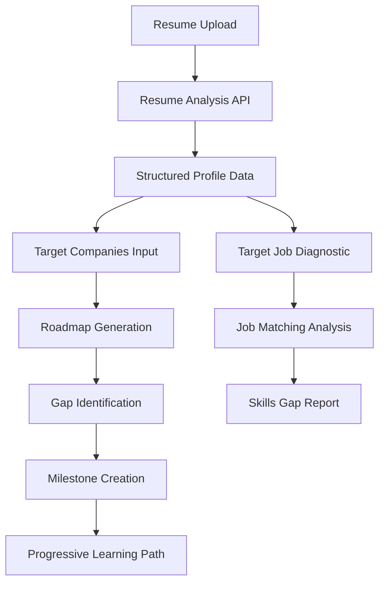

# PivotAI Gap Analysis Documentation

## Overview

PivotAI uses a sophisticated AI-powered system to identify and bridge the gap between a user's current professional profile and their target career goals. This document explains how the gap analysis works throughout the platform.

## Table of Contents

1. [Gap Analysis Architecture](#gap-analysis-architecture)
2. [Resume Analysis Phase](#1-resume-analysis-phase)
3. [Roadmap Generation Gap Analysis](#2-gap-analysis-in-roadmap-generation)
4. [Target Job Diagnostic](#3-detailed-job-matching)
5. [Gap Identification Methods](#4-how-gaps-are-identified)
6. [Gap Resolution Strategy](#5-gap-resolution-through-milestones)
7. [Progressive Gap Closure](#6-progressive-gap-closure)
8. [Implementation Examples](#implementation-examples)

## Gap Analysis Architecture

The gap analysis system operates through multiple interconnected components:



## 1. Resume Analysis Phase

**Endpoint**: `/api/analyze-resume`

The initial analysis extracts structured data from uploaded resumes:

### Extracted Data Structure
```javascript
{
  "skills": ["React", "Node.js", "JavaScript"],
  "experience": ["Junior Developer", "Intern"],
  "education": ["BS Computer Science"],
  "strengths": ["Problem solving", "Quick learner"],
  "weaknesses": ["System design", "Leadership"],
  "recommendations": ["Full Stack Developer", "Frontend Engineer"]
}
```

### Key Features
- **Skills Extraction**: Technical and soft skills identification
- **Experience Mapping**: Current role and seniority level
- **Weakness Detection**: Areas needing improvement
- **Initial Recommendations**: Suitable career paths

## 2. Gap Analysis in Roadmap Generation

**Endpoint**: `/api/generate-roadmap`

The roadmap generation includes comprehensive gap analysis:

### Gap Analysis Output Structure
```javascript
{
  "candidateGapAnalysis": {
    "currentStrengths": [
      "Strong foundation in React",
      "Good problem-solving skills"
    ],
    "criticalGaps": [
      "Cloud platform experience (AWS/GCP)",
      "System design knowledge",
      "Leadership experience"
    ]
  },
  "targetRoleRequirements": [
    "5+ years experience",
    "Expert in distributed systems",
    "Team leadership capability"
  ],
  "successMetrics": [
    "Complete cloud certification",
    "Lead 2+ team projects",
    "Design scalable system"
  ]
}
```

### Gap Categories Analyzed

1. **Technical Gaps**
   - Missing programming languages
   - Framework knowledge
   - Tool proficiency
   - Domain expertise

2. **Experience Gaps**
   - Years of experience
   - Role seniority
   - Industry exposure
   - Project complexity

3. **Soft Skill Gaps**
   - Leadership abilities
   - Communication skills
   - Team collaboration
   - Strategic thinking

## 3. Detailed Job Matching

**Component**: `TargetJobDiagnostic.tsx`

The most granular gap analysis occurs in job matching:

### Job Match Analysis Structure
```javascript
{
  "title": "Senior Software Engineer",
  "matchScore": 85,
  "matchingSkills": ["React", "Node.js", "Git"],
  "gapSkills": ["AWS", "Docker", "System Design"],
  "requiredSkills": ["React", "Node.js", "AWS", "Docker", "System Design", "Git"]
}
```

### Match Score Calculation
- **Has Skill**: +points based on importance
- **Missing Critical Skill**: -significant points
- **Missing Nice-to-Have**: -minor points
- **Extra Relevant Skills**: +bonus points

## 4. How Gaps Are Identified

### Direct Skill Comparison
```javascript
const requiredSkills = ["React", "AWS", "Python", "Docker"];
const currentSkills = ["React", "JavaScript", "Node.js"];

const gapSkills = requiredSkills.filter(
  skill => !currentSkills.includes(skill)
);
// Result: ["AWS", "Python", "Docker"]
```

### Experience Level Mapping
```
Current Position: Junior Developer (1-2 years)
Target Position: Senior Engineer (5+ years)
Experience Gap: 3-4 years + leadership experience
```

### Competency Assessment
```javascript
// Professional competencies comparison
currentCompetencies: {
  technical_expertise: 4,
  leadership: 2,
  system_design: 2
}

targetCompetencies: {
  technical_expertise: 8,
  leadership: 6,
  system_design: 7
}

// Gaps identified in all areas
```

## 5. Gap Resolution Through Milestones

### Milestone Generation Strategy

Each identified gap triggers specific milestone creation:

| Gap Type | Milestone Category | Example Milestone |
|----------|-------------------|-------------------|
| Technical Skill | Technical | "Master AWS Cloud Services" |
| Experience | Career | "Transition to Mid-Level Developer" |
| Leadership | Soft | "Lead Cross-Functional Team Project" |
| Domain Knowledge | Fundamental | "Study Distributed Systems Architecture" |
| Specialization | Niche | "Implement Machine Learning Pipeline" |

### Milestone Attributes for Gap Closure
```javascript
{
  "title": "Master AWS Cloud Services",
  "level": 2,
  "category": "technical",
  "estimatedHours": 60,
  "gapAddressed": "Cloud platform experience",
  "competencyImpact": {
    "technical_expertise": 6,
    "system_design": 4
  },
  "resources": [
    // Specific learning resources targeting the gap
  ]
}
```

## 6. Progressive Gap Closure

### Level-Based Progression

The system ensures gaps are closed in logical order:

```
Level 1-3: Foundation Building
├── Close fundamental knowledge gaps
├── Build core technical skills
└── Develop basic professional competencies

Level 4-6: Skill Specialization
├── Address intermediate technical gaps
├── Gain relevant experience
└── Develop domain expertise

Level 7-10: Advanced Mastery
├── Close senior-level skill gaps
├── Build leadership capabilities
└── Master system architecture
```

### Dynamic Gap Reassessment

As users progress, the system can:
1. **Re-evaluate remaining gaps** after level completion
2. **Generate new milestones** targeting updated gaps
3. **Adjust difficulty** based on learning pace
4. **Identify emerging gaps** from industry changes

## Implementation Examples

### Example 1: Frontend Developer → Full Stack Engineer

```javascript
// Current State
{
  skills: ["React", "CSS", "JavaScript"],
  experience: "Frontend Developer (2 years)"
}

// Target Role
"Full Stack Engineer at Tech Company"

// Identified Gaps
{
  technical: ["Backend development", "Database design", "API architecture"],
  experience: ["Full stack projects", "DevOps exposure"],
  tools: ["Node.js", "PostgreSQL", "Docker", "AWS"]
}

// Generated Milestones
Level 1: "Build RESTful API with Node.js"
Level 2: "Design and Implement PostgreSQL Database"
Level 3: "Create Full Stack Application"
Level 4: "Implement CI/CD Pipeline"
Level 5: "Deploy Application to AWS"
```

### Example 2: Junior → Senior with Leadership

```javascript
// Gap Analysis Results
{
  currentLevel: "Junior Developer",
  targetLevel: "Senior Tech Lead",
  gaps: {
    technical: ["System design", "Architecture patterns"],
    experience: ["3-5 years", "Team projects"],
    leadership: ["Mentoring", "Technical decisions", "Team management"]
  }
}

// Progressive Milestone Path
Levels 1-3: Technical foundation
Levels 4-5: Team collaboration and mentoring
Levels 6-7: Technical leadership
Levels 8-10: Strategic leadership
```

## API Integration Points

### 1. Resume Analysis Integration
```javascript
// POST /api/analyze-resume
const resumeData = await analyzeResume(resumeText);
const initialGaps = identifyWeaknesses(resumeData);
```

### 2. Roadmap Generation Integration
```javascript
// POST /api/generate-roadmap
const roadmap = await generateRoadmap({
  resumeAnalysis,
  targetCompanies,
  professionalField
});
// Returns milestones addressing identified gaps
```

### 3. Progress Tracking Integration
```javascript
// As milestones complete, gaps close
const updatedGaps = reassessGaps(
  originalGaps,
  completedMilestones
);
```

## Best Practices

1. **Comprehensive Analysis**: Consider technical, experience, and soft skill gaps
2. **Progressive Approach**: Address foundational gaps before advanced ones
3. **Realistic Timelines**: Set achievable milestone timeframes
4. **Continuous Reassessment**: Update gap analysis as user progresses
5. **Personalized Solutions**: Tailor gap resolution to individual circumstances

## Future Enhancements

1. **Real-Time Market Analysis**: Integrate job market data for dynamic gap identification
2. **Peer Comparison**: Compare gaps with successful professionals in similar transitions
3. **Industry-Specific Gaps**: Specialized gap analysis for different professional fields
4. **Predictive Gap Analysis**: Anticipate future skill requirements
5. **Gap Closure Analytics**: Track effectiveness of different learning paths

## Conclusion

PivotAI's gap analysis system provides a comprehensive framework for identifying and systematically closing the gaps between a user's current professional state and their career goals. Through AI-powered analysis, progressive milestone generation, and continuous assessment, the platform ensures users have a clear, actionable path to their target roles.