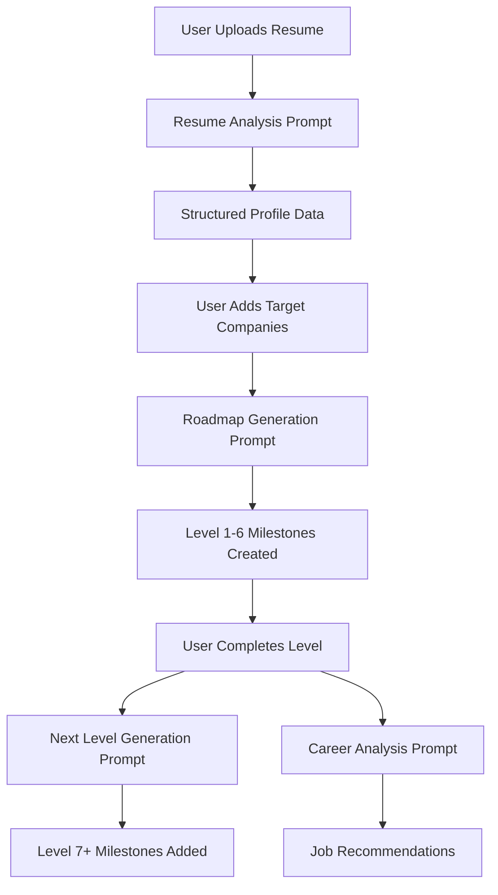

# PivotAI OpenAI Prompts Analysis

## Overview

PivotAI uses a sophisticated system of AI prompts that work together to create a personalized career development experience. The platform leverages OpenAI's GPT-4 models to analyze resumes, generate career roadmaps, and progressively build learning paths.

## AI Prompt Architecture

### 1. Core Prompts

#### Resume Analysis (`/api/analyze-resume`)
- **Purpose**: Extracts structured data from uploaded resumes
- **Model**: GPT-4o
- **Temperature**: 0.2 (for consistency)
- **Output**: JSON with skills, experience, education, strengths, weaknesses, and recommendations
- **Key Feature**: Enforces strict JSON schema with fallback field mapping

#### Career Roadmap Generation (`/api/generate-roadmap`)
- **Purpose**: Creates a comprehensive, leveled career roadmap
- **Model**: GPT-4o
- **Temperature**: 0.2
- **Output**: 6 milestones across different categories with resources and tasks
- **Key Features**:
  - Progressive leveling system (1-10)
  - Career progression milestones
  - Real, verified learning resources
  - Field-specific attributes

#### Next Level Generation (`/api/generate-next-level`)
- **Purpose**: Dynamically generates new milestones when user completes a level
- **Model**: GPT-4o
- **Temperature**: 0.7 (for creativity)
- **Output**: 3-5 milestones for the next level
- **Key Feature**: Builds upon previous level completions

#### Career Analysis (`/api/analyze-career`)
- **Purpose**: Provides job recommendations based on user profile
- **Model**: GPT-4o
- **Output**: Job matches with skill gap analysis

## How the Prompts Work Together

### 1. User Journey Flow



### 2. Data Flow Between Prompts

#### Resume Analysis → Roadmap Generation
The resume analysis output directly feeds into the roadmap generation:
```javascript
// Resume analysis provides:
{
  skills: ["React", "Node.js"],
  experience: ["Junior Developer"],
  strengths: ["Problem solving"],
  weaknesses: ["System design"]
}

// This data is embedded in roadmap prompt:
"Candidate's current profile:
- Skills: React, Node.js
- Experience: Junior Developer
- Strengths: Problem solving
- Weaknesses: System design"
```

#### Roadmap → Next Level Generation
Completed milestones inform the next level:
```javascript
// Previous levels completed:
"Level 1: JavaScript Fundamentals
 Level 2: React Development
 Level 3: Backend with Node.js"

// Prompt generates Level 4 building on these
```

### 3. Progressive Difficulty System

The prompts implement a sophisticated leveling system:

**Level 1-3**: Fundamentals and entry-level skills
- Focus on basic concepts
- 20-40 hour milestones
- Self-paced learning resources

**Level 4-6**: Practical application and specialization
- Complex projects
- 40-60 hour milestones
- Mix of learning and building

**Level 7-10**: Leadership and expertise
- Advanced topics
- 60-100 hour milestones
- Mentorship and teaching components

### 4. Category Distribution

Each prompt ensures balanced skill development:
- **Technical** (30%): Programming, frameworks, tools
- **Fundamental** (30%): Core concepts, problem-solving
- **Soft Skills** (15%): Communication, leadership
- **Niche** (15%): Emerging technologies
- **Career** (10%): Job positioning, networking

## Prompt Engineering Techniques

### 1. Structured Output Enforcement
```javascript
"Return ONLY valid JSON in this format:
{
  // Exact schema specification
}"
```

### 2. Context Preservation
Each prompt includes relevant history:
- Previous completions
- User's original goals
- Current skill level

### 3. Resource Validation
```javascript
"Resources must be:
- Real, working URLs
- From reputable sources
- Free or low-cost
- Recently updated"
```

### 4. Progressive Enhancement
```javascript
"Generate milestones that:
1. Build upon skills from previous levels
2. Progressively move toward target roles
3. Include appropriate challenge increase"
```

## Prompt Synergy Features

### 1. Skill Gap Analysis
Resume analysis identifies weaknesses → Roadmap generation creates targeted milestones

### 2. Adaptive Difficulty
Completion speed influences next level difficulty through context passing

### 3. Career Alignment
All prompts reference target companies to maintain focus

### 4. Competency Tracking
Each milestone impacts professional competencies:
```javascript
competencyImpact: {
  technical_expertise: 8,
  problem_solving: 6,
  continuous_learning: 4
}
```

## Implementation Details

### 1. Error Handling
- Retry logic with exponential backoff
- Fallback responses for failures
- Detailed error logging

### 2. Performance Optimization
- Consistent model usage (GPT-4o) for all tasks
- Timeout configurations (2-5 minutes)
- Response caching where applicable

### 3. Validation Layers
- JSON schema validation
- Field presence checking
- Alternative field name mapping
- Type coercion for robustness

## Best Practices Implemented

1. **Low Temperature for Consistency**: Analysis and roadmap generation use 0.2
2. **Higher Temperature for Creativity**: Next level generation uses 0.7
3. **Model Consistency**: All prompts use GPT-4o for best quality and consistency
4. **Structured Prompts**: Clear sections, examples, and constraints
5. **Progressive Context**: Each prompt builds on previous interactions

## Future Enhancement Opportunities

1. **Industry-Specific Prompts**: Tailored prompts for different professional fields
2. **Real-Time Market Data**: Integration with job market APIs
3. **Collaborative Filtering**: Learning from successful user paths
4. **Multi-Language Support**: Prompts in different languages
5. **Feedback Loop**: User success data improving prompt effectiveness

## Conclusion

PivotAI's prompt system creates a cohesive, progressive learning experience by:
- Starting with comprehensive analysis
- Building personalized, leveled roadmaps
- Dynamically extending based on progress
- Maintaining focus on career goals throughout

The prompts work as an integrated system rather than isolated components, creating a seamless user experience that adapts to individual progress and maintains alignment with career objectives.