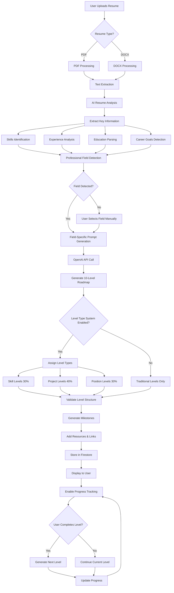

# Roadmap Generation Process

## Overview

The Crackd platform generates personalized career roadmaps using AI-powered analysis of user resumes and career goals. This document details the complete roadmap generation process, from initial user input to the final personalized roadmap.

## Process Flowchart



## Detailed Process Steps

### 1. Resume Upload & Processing

#### 1.1 File Upload
- **Supported Formats**: PDF, DOCX
- **Max File Size**: 10MB
- **Storage**: Firebase Storage with secure URLs

#### 1.2 Text Extraction
```typescript
// PDF Processing (using PDF.js)
const extractPDFText = async (file: File): Promise<string> => {
  const pdfjsLib = await import('pdfjs-dist');
  const arrayBuffer = await file.arrayBuffer();
  const pdf = await pdfjsLib.getDocument({ data: arrayBuffer }).promise;
  // Extract text from all pages
};

// DOCX Processing (using Mammoth)
const extractDOCXText = async (file: File): Promise<string> => {
  const mammoth = await import('mammoth');
  const arrayBuffer = await file.arrayBuffer();
  const result = await mammoth.extractRawText({ arrayBuffer });
  return result.value;
};
```

### 2. AI-Powered Resume Analysis

#### 2.1 OpenAI Integration
- **Model**: GPT-4 or GPT-3.5-turbo
- **Temperature**: 0.7 for balanced creativity
- **Max Tokens**: 4000 for comprehensive analysis

#### 2.2 Information Extraction
The AI analyzes the resume to extract:
- **Skills**: Technical and soft skills
- **Experience**: Job titles, companies, duration
- **Education**: Degrees, institutions, certifications
- **Projects**: Personal and professional projects
- **Career Objectives**: Stated or inferred goals

### 3. Professional Field Detection

#### 3.1 Supported Fields
1. **Computer Science** (CS)
2. **Engineering** (Various disciplines)
3. **Medicine** (Healthcare professions)
4. **Business** (Management, Finance, Marketing)
5. **Law** (Legal professions)

#### 3.2 Detection Algorithm
```typescript
const detectProfessionalField = (resumeAnalysis: ResumeAnalysis): ProfessionalField => {
  const fieldKeywords = {
    CS: ['software', 'programming', 'developer', 'coding', 'algorithm'],
    Engineering: ['engineer', 'mechanical', 'electrical', 'civil', 'design'],
    Medicine: ['medical', 'doctor', 'nurse', 'healthcare', 'clinical'],
    Business: ['business', 'management', 'finance', 'marketing', 'sales'],
    Law: ['legal', 'attorney', 'lawyer', 'paralegal', 'law']
  };
  
  // Score each field based on keyword matches
  // Return field with highest confidence score
};
```

### 4. Roadmap Generation

#### 4.1 Prompt Engineering
Field-specific prompts are used to generate relevant roadmaps:

```typescript
const generateFieldPrompt = (field: string, analysis: ResumeAnalysis) => {
  const basePrompt = `Generate a 10-level career roadmap for ${field}...`;
  const fieldSpecificContext = getFieldContext(field);
  const personalizedContext = getPersonalizedContext(analysis);
  
  return `${basePrompt}\n${fieldSpecificContext}\n${personalizedContext}`;
};
```

#### 4.2 Level Structure
Each roadmap contains exactly 10 levels with:
- **Level Number**: 1-10
- **Title**: Descriptive level name
- **Description**: 2-3 sentences about the level
- **Key Milestones**: 3-5 specific achievements
- **Skills to Develop**: Technical and soft skills
- **Resources**: Learning materials and links
- **Estimated Duration**: Time to complete level

### 5. Level Type System

#### 5.1 Level Type Distribution
- **Skill Levels** (30%): Focus on learning new competencies
- **Project Levels** (40%): Hands-on project completion
- **Position Levels** (30%): Career advancement milestones

#### 5.2 Type Assignment Logic
```typescript
const assignLevelTypes = (levels: Level[]): TypedLevel[] => {
  const distribution = {
    skill: Math.floor(levels.length * 0.3),
    project: Math.floor(levels.length * 0.4),
    position: Math.ceil(levels.length * 0.3)
  };
  
  // Strategic placement algorithm
  // Ensures logical progression
};
```

### 6. Milestone Generation

#### 6.1 Milestone Structure
```typescript
interface Milestone {
  id: string;
  title: string;
  description: string;
  completed: boolean;
  completedAt?: Date;
  resources: Resource[];
  estimatedHours: number;
  prerequisites: string[];
}
```

#### 6.2 Micro-Milestones
Each main milestone can have 2-4 micro-milestones for granular tracking:
- Specific tasks or sub-goals
- Easier to complete and track
- Provides frequent sense of achievement

### 7. Data Storage & Retrieval

#### 7.1 Firestore Schema
```typescript
// User Profile Document
{
  userId: string;
  professionalField: string;
  currentLevel: number;
  roadmapId: string;
  progress: {
    completedLevels: number[];
    completedMilestones: string[];
    totalProgress: number;
  }
}

// Roadmap Document
{
  roadmapId: string;
  userId: string;
  field: string;
  levels: Level[];
  createdAt: Timestamp;
  lastUpdated: Timestamp;
  version: number;
}
```

### 8. Progress Tracking

#### 8.1 Completion Criteria
- All milestones in a level must be completed
- User confirmation required
- Automatic progress calculation

#### 8.2 Analytics
- Time spent per level
- Milestone completion rate
- Skill development tracking
- Career progression metrics

### 9. Dynamic Level Generation

When a user completes a level, the system can:
1. Generate the next level dynamically
2. Adapt based on user progress
3. Incorporate feedback and preferences
4. Update difficulty and complexity

### 10. Gamification Integration

#### 10.1 Achievement System
- Level completion badges
- Streak tracking
- Skill mastery recognition
- Career milestone celebrations

#### 10.2 Character Progression
- XP gain for completed tasks
- Attribute development (Intelligence, Creativity, etc.)
- Visual progress indicators

## Error Handling & Edge Cases

### Common Scenarios
1. **Unrecognized Resume Format**: Fallback to manual input
2. **AI Generation Failure**: Retry with exponential backoff
3. **Invalid Field Detection**: User selection override
4. **Incomplete Data**: Progressive enhancement approach

### Error Recovery
```typescript
const generateRoadmapWithRetry = async (
  prompt: string, 
  maxRetries: number = 3
): Promise<Roadmap> => {
  for (let i = 0; i < maxRetries; i++) {
    try {
      return await openai.generateRoadmap(prompt);
    } catch (error) {
      if (i === maxRetries - 1) throw error;
      await delay(Math.pow(2, i) * 1000); // Exponential backoff
    }
  }
};
```

## Performance Optimization

### Caching Strategy
1. **Resume Analysis**: Cache for 24 hours
2. **Generated Roadmaps**: Permanent storage
3. **Field Detection**: Cache with user profile
4. **Resources**: CDN caching for external links

### Async Processing
- Background job for large resume processing
- Streaming responses for real-time feedback
- Parallel milestone generation

## Security Considerations

### Data Protection
1. **Resume Storage**: Encrypted at rest
2. **API Keys**: Environment variables only
3. **User Data**: Strict access controls
4. **PII Handling**: Anonymization where possible

### Rate Limiting
- Per-user generation limits
- API call throttling
- Cost management controls

## Future Enhancements

### Planned Features
1. **Multi-language Support**: Roadmaps in different languages
2. **Industry Partnerships**: Verified career paths
3. **Mentor Matching**: Connect with industry professionals
4. **Real-time Collaboration**: Team roadmaps
5. **AI Coaching**: Personalized guidance at each level

### Scalability Considerations
- Horizontal scaling for API services
- CDN integration for global performance
- Database sharding for user growth
- Microservices architecture migration

## Conclusion

The roadmap generation process is a sophisticated system that combines AI analysis, personalized content generation, and gamified progress tracking to create engaging career development paths. The modular architecture allows for continuous improvement and feature additions while maintaining system reliability and performance.